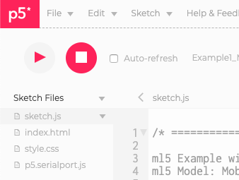

# Applications of Machine Learning models

## Session A: Other pre-trained models

### Objectives:
* Understanding how to use pre-trained models other than image classification.
* Ability to work with PoseNet and ml5.js
* Ability to work with UNet Image Segmenttaion and ml5.js.
* Week 3 Slides <-> link to come

### ml5 video tutorials

### ml5 code editor examples

### Related Projects
* [Sidewalk Orchestra](https://twitter.com/c_valenzuelab/status/979131716907536384) by Cristóbal Valenzuela
* [Pose Music](https://codepen.io/teropa/full/QxLrMp/) by Tero Parviainen
* Golan Levin’s Electronic Media Studio (Carnegie Mellon School of Art) students using ml5.js and p5.js:
    * [Nixel](http://cmuems.com/2018/60212f/nixel/10/12/nixel-body/)
    * [Chromsan](http://cmuems.com/2018/60212f/chromsan/10/12/chromsan-body/)
    * [Casher](http://cmuems.com/2018/60212f/casher/10/12/casher-body/)
    * [Shuann](http://cmuems.com/2018/60212f/shuann/10/12/shuann-body/)
    * ([all class projects in the Augmented Body Gallery](http://cmuems.com/2018/60212f/deliverables/5-due-10-12/augmented-body-gallery/) using a variety of tools)
* Tensorflow Pose Estimation Use Cases:
    * [The Treachery of Sanctuary](https://www.youtube.com/watch?v=I5__9hq-yas&feature=youtu.be) by Chris Milk
    * [Gait Analysis](https://www.runnersneed.com/expert-advice/gear-guides/gait-analysis.html) from runnersneed

### Assignment
1. Read [Real-Time Human Pose Estimation in the Browser with TensorFlow.js](https://medium.com/tensorflow/real-time-human-pose-estimation-in-the-browser-with-tensorflow-js-7dd0bc881cd5) by Dan Oved, with editing and illustrations by Irene Alvarado and Alexis Gallo.
2. Read [Mixing movement and machine](https://medium.com/artists-and-machine-intelligence/mixing-movement-and-machine-848095ea5596) by Maya Man
4. Read [Review of Deep Learning Algorithms for Image Semantic Segmentation](https://medium.com/@arthur_ouaknine/review-of-deep-learning-algorithms-for-image-semantic-segmentation-509a600f7b57) by Arthur Ouaknine
3. Explore [COCO Dataset](http://cocodataset.org/#explore). What surprises you about this data set? How is it similar or different to ImageNet? What questions do you have? Can you think of any ethical considerations around how this data was collected? Are there privacy considerations with the data?

## Session B: Physical interaction

### Objective:
* Explore the possibilities of physical interaction as the output of a machine learning system.

### Code Examples
In each example, a p5.js sketch captures some input data and sends it to an Arduino. The Arduino sketch tells the microcontroller how to read that data and what to do with it. This type of communication is called [asynchronous serial communication](https://itp.nyu.edu/physcomp/lessons/serial-communication/serial-communication-the-basics/). (Fun fact: the Arduino can *also* capture data and send it to a p5.js sketch!)

* Webcam Image Classification using MobileNet to Turn LED On/Off
    * [p5.js sketch with ml5 + p5.serialport](https://editor.p5js.org/enickles/sketches/6vnrbkcrN) (move to ima_ml account)
    * [Arduino sketch](examples_arduinoSketches/Example1_MobileNet_LED_On_Off.ino)
* Pose Detection using PoseNet to Fade LED
    * [p5.js sketch with ml5 + p5.serialport](https://editor.p5js.org/enickles/sketches/0dgoVkNyu) (move to ima_ml account)
    * [Arduino sketch](examples_arduinoSketches/Example2_PoseNet_Fade_LED.ino)

### Materials for Examples
* [p5.js web editor](https://editor.p5js.org)
* [Arduino IDE 1.8.9 app](https://www.arduino.cc/en/main/software)
* [p5.serialcontrol app](https://github.com/p5-serial/p5.serialcontrol/releases/tag/0.1.1) to enable serial communication between your p5.js sketch in the browser and your Arduino microcontroller. Download the latest version, and save it in your Applications folder. If you use a Mac, then download and install this option: `p5.serialcontrol-darwin-x64.zip`.
* 1 USB Cable
* 1 Arduino Uno
* 1 Half-size Breadboard
* 1 LED
* 1 220 Ohm Resistor
* Jumper Wires
* [Image of an Arduino connected to an LED](images/arduino_fritzingDiagram.png)

### Serial Communication Checklist
For the above examples, check these items if nothing happens on the Arduino when you start the p5.js sketch. Use this checklist for your own projects, too!

#### Check 1 - Arduino
* Your Arduino is connected to your computer 
* The Arduino IDE sofware registers your Arduino board at a paricular port: 
* You uploaded the correct Arduino sketch to your Arduino
* Everything is wired [correctly](images/arduino_fritzingDiagram.png)
* The Arduino IDE's Serial Monitor is not open

#### Check 2 - p5.serialcontrol App
* The p5.serialcontrol app is running and the port to which your Arduino is connected is open and connected: 


#### Check 3 - p5 Web Editor
* Your p5.js sketch includes the p5.serialport library file in the sidebar:  
* Your p5.js sketch knows to use the p5.serialport library by referencing it in your project's `index.html` file like this: 
  ```
  <body>
    <script src="p5.serialport.js"></script>
    <script src="sketch.js"></script>
  </body>
  ```
* Your p5.js sketch is programmed to send data to the same port to which your Arduino is connected. Look for this method in your p5.js setup() function to update the port number.
    ```
    serial.open("/dev/tty.usbmodem14301");
    ``` 
* Bonus! This last one is not related to serial communication, but you should check it anyway. Make sure your p5.js sketch also includes the ml5.js library by referencing it in the `index.html` file. Look for this line between the `header tags`.
    ```
    <script src="https://unpkg.com/ml5@0.3.1/dist/ml5.min.js" type="text/javascript"></script>
    ```
    
### Additional Resources
* [Asynchronous Serial Communication: The Basics](https://itp.nyu.edu/physcomp/lessons/serial-communication/serial-communication-the-basics/)
* [Lab: Serial output from P5.js](https://itp.nyu.edu/physcomp/labs/labs-serial-communication/lab-serial-output-from-p5-js/)
* [p5.serialport library](https://github.com/p5-serial/p5.serialport)


### Related Projects
* [PomPom Mirror](https://vimeo.com/128375543) by Danny Rozin
* [Now You Are In the Conversation](https://chelseachenchen.com/portfolio/now-you-are-in-the-conversation/) by Chelsea Chen Chen


### Assignment 3:
1. Prototype a physical interaction as the output of a machine learning model using any of the tools or techniques demonstrated in weeks 2 and 3. This can be a new idea or build off of your week 2 assignment. Here are some questions to explore: 
    * For image classification, how might you use confidence score data as a type of creative input?
    * For pose detection, how might you work with multiple keypoints?
    * What other creative outputs can you use? Speakers? Motors? What else?
2. Document your exercise in a blog post and add a link to the post and your sketch on the [Assignment 3 Wiki](https://github.com/ml5js/Intro-ML-Arts-IMA/wiki/Assignment-3). In your blog post, include visual documentation such as a recorded screen capture / video of your training session and sketch running in the browser. How the readings inform your idea and development of the project?
