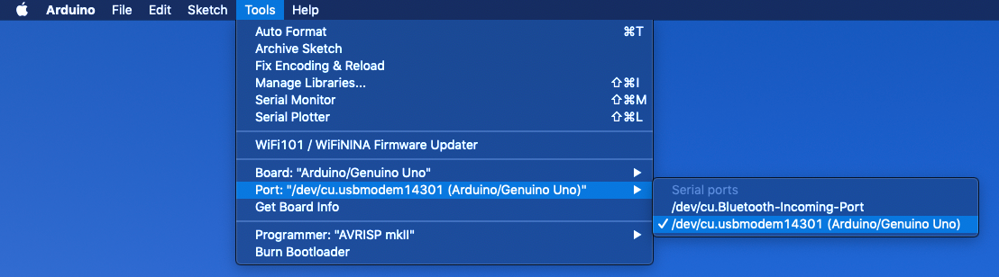
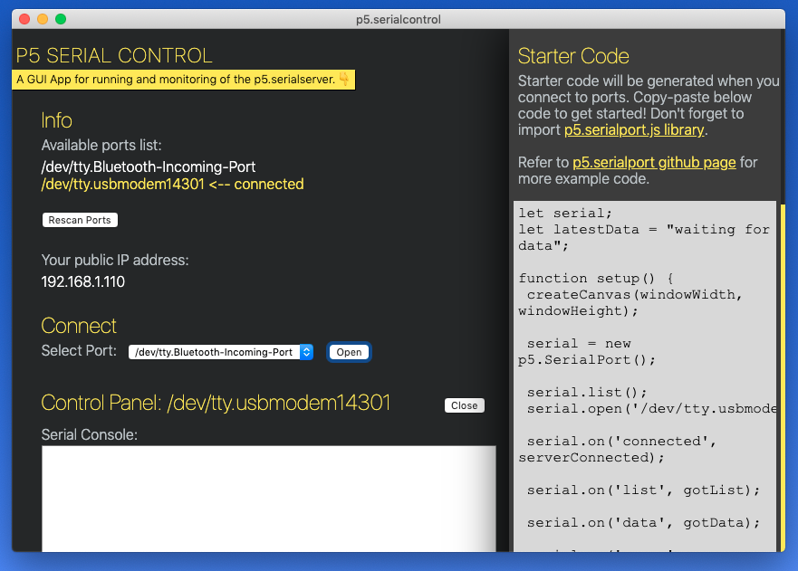

# Serial Communication Checklist

## Check 1 - Arduino
* Your Arduino is connected to your computer 
* The Arduino IDE sofware registers your Arduino board at a paricular port. In this example, the port is `usbmodem14301`: 
* You uploaded the correct Arduino sketch to your Arduino
* Everything is wired correctly
* The Arduino IDE's Serial Monitor is NOT open

## Check 2 - p5.serialcontrol App
* The p5.serialcontrol app is running and the port to which your Arduino is connected is open and connected. Notice again that the port is `usbmodem14301`: 


## Check 3 - p5 Web Editor
* Your project includes the p5.serialport library (and the ml5.js library!) in the `header tags` of the `index.html` file: 
  ```
    <script src="https://unpkg.com/ml5@0.2.3/dist/ml5.min.js" type="text/javascript"></script>
    <script src="https://cdn.jsdelivr.net/npm/p5.serialserver@0.0.28/lib/p5.serialport.js"></script>
  ```
* Your p5.js sketch is sending data to the same port to which your Arduino is connected. Look for this method in your p5.js setup() function to update the port number. (There's that `usbmodem14301` port again.)
    ```
    serial.open("/dev/tty.usbmodem14301");
    ``` 