# Data Wrangling Tutorial

Using the Titanic Survival dataset as an example, this tutorial will go through the process for finding and preparing your own dataset to use in a DIY neural network in ml5.

## 1. Looking for a Dataset

There are many places to find datasets on the internet. For example, most large cities now have Open Data portals and many federal agencies publish data online. Depending on where you are looking, the dataset may have been created for different uses and not be structured for your machine learning needs. One especially good place for machine learning datasets is [Kaggle](https://www.kaggle.com/datasets), which is a site that hosts data science competitions.

To find the dataset that is right for your project, it’s helpful to ask some critical questions as you do your research into different datasets and sources. Important questions to ask yourself include:
* Who collected and compiled the dataset?
* Why was the data collected and compiled (to comply with regulations, for fun, for research purposes, etc.)?
* What methods were used to collect the data (in-person survey, sensors, etc.)?
* How many rows and columns does the dataset have? If you have to download it, what is the file size?
* Is there a data dictionary associated with the dataset (a key that tells you about what is included in the dataset)?
* Are there missing, incomplete, or invalid elements of the dataset? What other problems do you notice?
* What format is the dataset in (for example csv, json, pdf)?
* How is the dataset structured? For example, is there one row per observation or is it aggregated in a different way?

## 2. Download the Data

For this example, we are going to be working with the Titanic Passenger Survival dataset. We can download this from a variety of places - let’s go with [OpenML](https://www.openml.org/d/40945).

The link above takes us to the data dictionary for the Titanic Passenger Survival dataset. You can see that OpenML has great documentation on all of the variables for this dataset, including how many missing values there are and showing the range of values. However, it doesn’t give a description of what each variable name means. Luckily we can find that on [Kaggle](https://www.kaggle.com/c/titanic/data).

To download this dataset from the OpenML site, click the download CSV cloud icon and save it with a name that you will remember - something like titanic_raw:


## 3. Get to Know Your Data

We are going to use Google Sheets to take a closer look at our data. There are different approaches to looking at and cleaning data, and you may choose to use R, Python or Stata if you are comfortable with these tools.

Some datasets you download will be “clean” and others will be “messy” - this refers to the extent to which the dataset has been formatted and checked for accuracy and completeness. In the case of the Titanic Passenger Survival dataset, we are going to need to do some of this ourselves. Before we do so, the first step is to get to know our data better. This will help us see what we need to change about it in order to clean it up and have it ready for our model.

Here are 10 questions you can ask to get to know your data:
1. What are the dimensions? i.e. how many rows and columns does it have?
2. What are the variables (their names and how many)?
3. What can you see in the first 5-20 rows? Is there anything you can learn from this?
4. What are the data types (int, string, float)? Are these correct?
5. Are any of the variables missing values?
6. Are there any duplicate rows?
7. Would it be helpful to combine or separate columns?
8. What are some common values you can see? Do these seem right? Are there any outliers (values that seem wrong or far out of the normal range)?
9. Is it helpful to visualize any variables with a histogram? This is a type of bar chart showing the range of values for a given variable.
10. Is it helpful to visualize any variables with a scatter plot? This is a graph that uses dots to plot two variables, one on the x axis and the other on the y axis.

### Google Sheets
Create a new Google sheet and open your Titanic dataset:

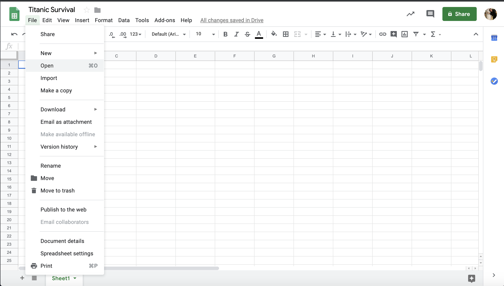

Here it is!

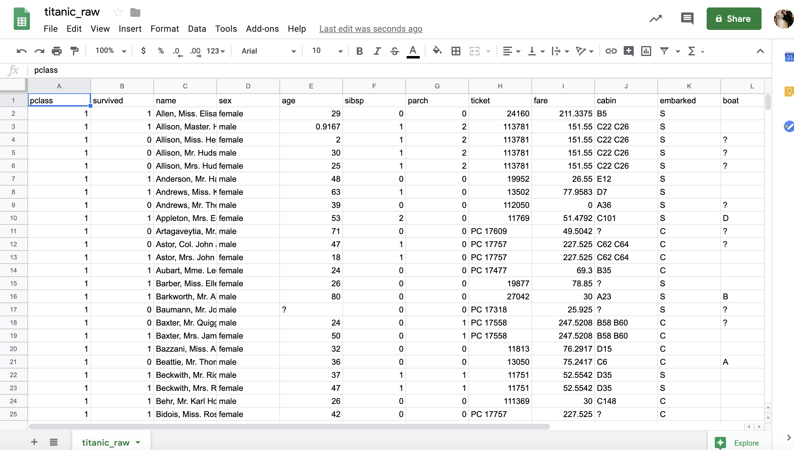

Let’s answer the above questions for the Titanic Passenger Survival dataset:
1. Dimensions?
...Rows: 1,310
...Columns: 14
2. Variables?
...There are 14 variables on passenger bio information: pclass, survived, name, sex, age, sibsp, parch, ticket, fare, cabin, embarked, boat, body, homedest
3. First 5-20 Rows?
...Most of the information seems complete. We can see that right now it’s sorted by class. The values seem to match their labels.
4. Data types?
...We have strings, float values, and categorical variables.
5. Any missing values?
...Yes, lots! Importantly there are 263 missing values under age.
6. Duplicates?
...Nope!
7. Combine or separate columns?
...To keep the model simple, let’s keep following and delete the others: Survived, Sex, Fare, Age, Class.
8. Common values?
...There seem to be a lot of low fares. Age also skews low.
9. and 10. Visualize?
...We are going to skip this for now, but feel free to do on your own!

## 4. Clean Your Data

Why is data cleaning important? In data science/machine learning/computer science there is a saying: “garbage in, garbage out.” What that means is that if you put bad (i.e. messy, incomplete or inaccurate) data into your model, you are going to get bad results. Therefore, data cleaning is worth your time...and it does take a lot of time! Data Scientists [estimate](https://www.forbes.com/sites/gilpress/2016/03/23/data-preparation-most-time-consuming-least-enjoyable-data-science-task-survey-says/#fe8085b6f637) that they spend 80% of their time collecting and cleaning data. WOW, you could do this for your full time job!

Let’s make a copy of the dataset and rename it to be something like “titanic_clean” or “titanic_cleaned.”


### Formatting

Let’s first clean up the fare column to make the numbers rounded without decimal places:
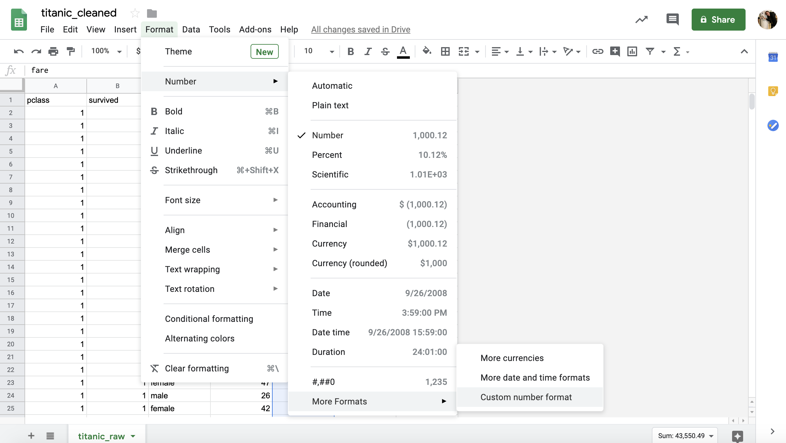

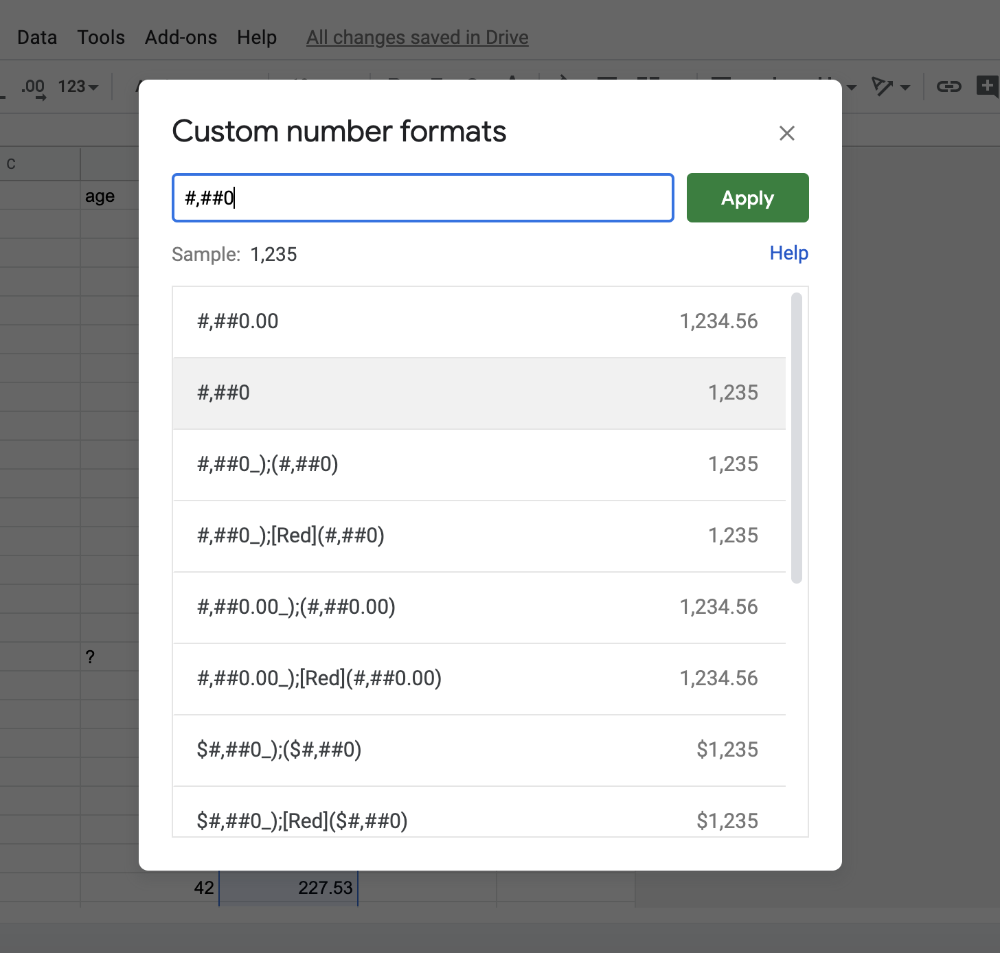


This looks better:

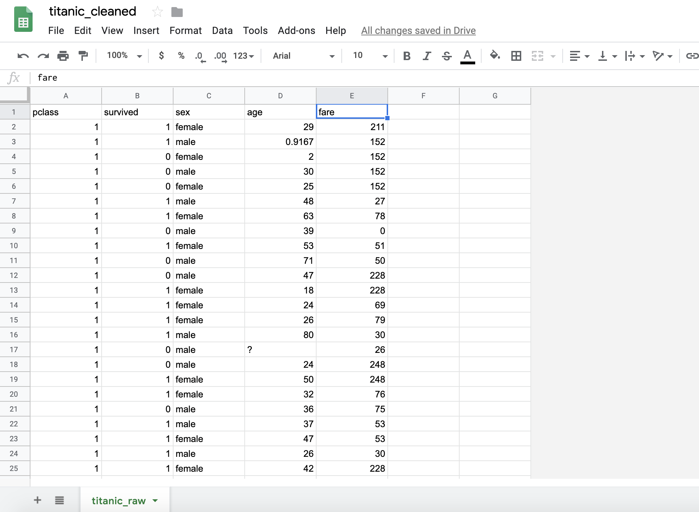

### Categorical variables

Let’s clean up the pclass variable so that the ml5 neural network can interpret it. For categorical variables, the ml5 DIY neural network needs strings instead of numbers. We are going to turn the numbers 1, 2, and 3 into first, second and third.

Start by making a new column next to the class column:
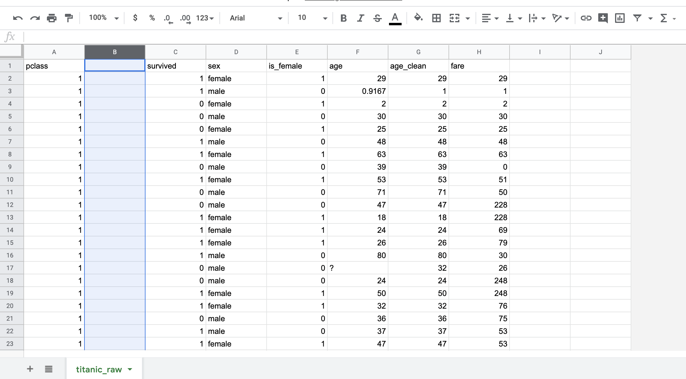

We’ll use the below formula to convert the numbers to strings. Be aware, you may need to change the cell numbers:

```
=IF(A2=1,"first", IF(A2=2,"second", IF(A2=3,"third")))
```

Pull down the bottom right corner of the first cell to apply the formula to the next few rows.

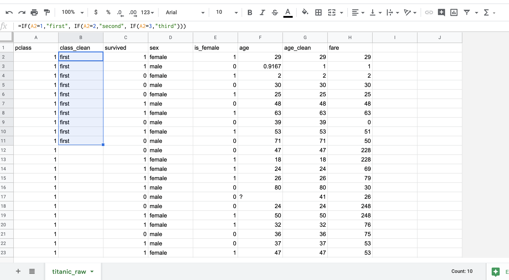

Looks good! Now click the little blue box in the bottom corner of the highlighted cells to copy the formula to the rest of the cells in the column.


If needed, this same method can be applied in reverse for converting strings to numbers!

### Missing Values
Now we need to fill in the age column, which has many missing values, indicated by a “?”. We will need to estimate the missing ages based on the other information we have access to. There are many methods we could use to do this. One simple way to fill in these missing ages would be to calculate the average age based on the ages we do have and use this number for all of the missing ages. One slightly more nuanced way is to calculate the average age and then pick random numbers within one standard deviation of the average for the missing ages. The standard deviation is a statistical measure for how dispersed a dataset is - in other words, how closely the other values are clustered around the mean. This will look like the following:

For each missing value, we’ll choose a random number between the following range range:
* Low end of range: average - standard deviation
* High end of range: average + standard deviation

By doing this, we will have a bit more variation in age than simply filling all missing values with the average, but will still keep the mean the same. To do this, we will use the following formula (again, you may need to change the cell numbers):

```
=IF(E2="?", RANDBETWEEN((AVERAGE(E:E)-STDEV(E:E)),(AVERAGE(E:E)+STDEV(E:E))), IF(E2=E2, E2))
```
Follow the same process you used in the previous step to create a new column and autofill the entire column. Because the number are random, you will not get the exact number below, but you should manually check a few of the results to make sure that the values were filled in correctly.

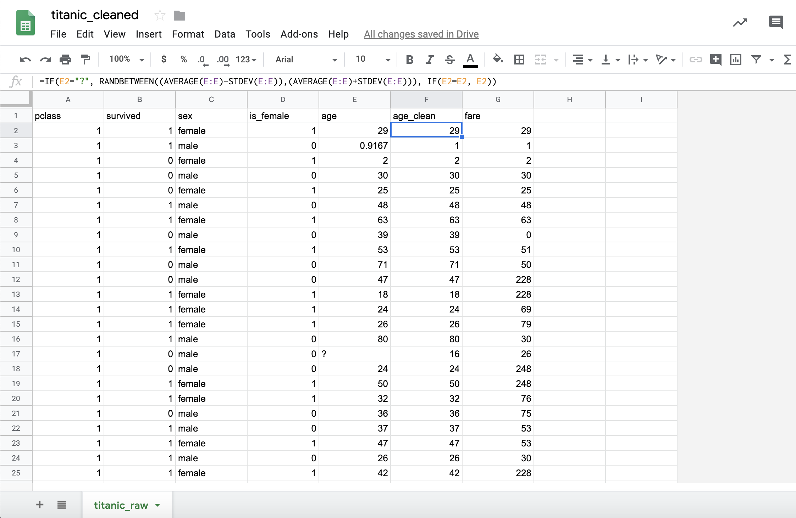


Finally, there is one missing value in the fare column. Let’s delete that row to keep it simple.

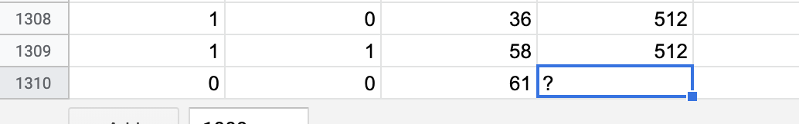

Now our dataset is looking pretty good!

## 5. Check and Export

In order to get rid of the uncleaned class and age columns, we need to make a new sheet with a copy of our spreadsheet without conditional formatting. Make a new sheet and name it “titanic_clean”.  

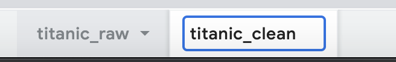

With the first cell selected in your titanic_raw sheet, select your whole spreadsheet by pressing command-A. Right click and select copy.
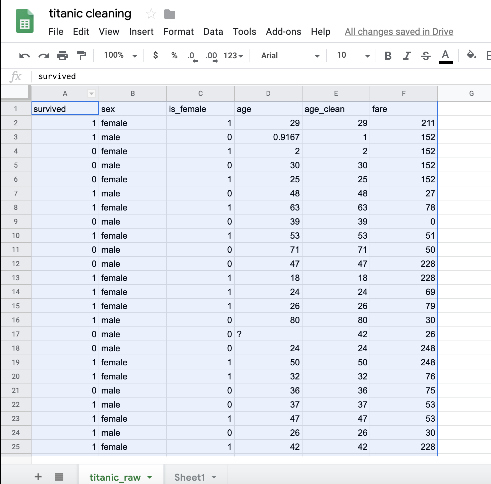


Navigate to your second sheet tab and right click in the first cell, then under the Edit menu, select paste special > paste values only
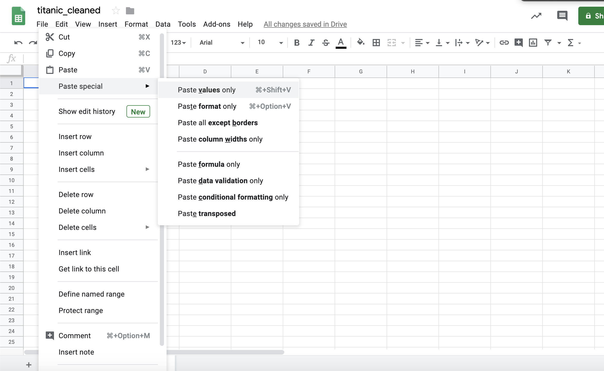


If the fare or age columns went back to their decimal values, use the formatting tool to round them again. Your result should look something like this:
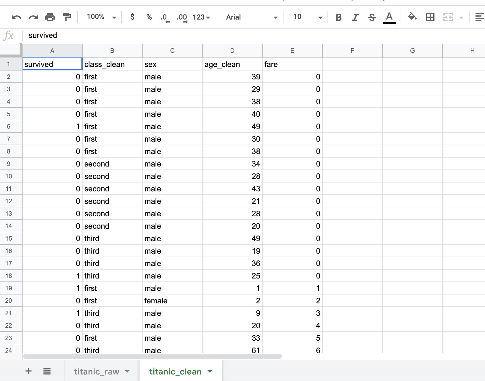


Now we are ready to export! From the File menu select Download and choose CSV:
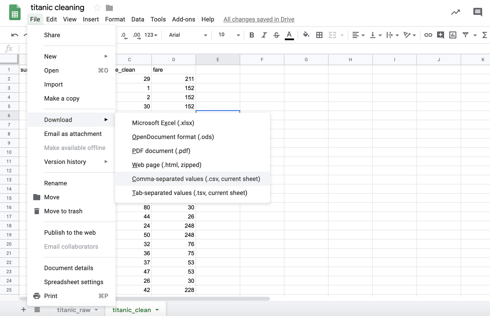

Rename the file with a title you’ll remember (something like titanic_clean) and save the file in your project directory.

Now you’re ready to train your model!

https://docs.google.com/spreadsheets/d/1UKmuTgY8qWnZ-jQm9NBL0HGwlJS4e4VQTgNXTtluTCw/edit#gid=1774164161
